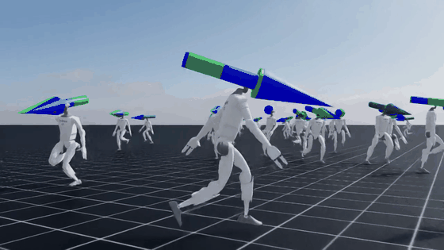

# Preview รอบ 3 — typing SVG + GIF

## ส่วนที่ 1 — เลือก typing SVG

รอข้อความวิ่งครบรอบก่อนตัดสิน (วนทุก ~3 วิ)

### A — เหลือบรรทัดเดียว (ตัดบรรทัดที่ขัดออก)

### B — เพิ่มบรรทัดที่ตรงกับ Now

### C — ใช้กรอบของวิชา

### D — ของเดิม (ตัวที่ขัดกับเนื้อ)

---

## ส่วนที่ 2 — GIF หุ่นวิ่ง (560px · 3.37 MB)

### วางแบบ 1 — ใต้บล็อก STATUS มี caption ให้เครดิต

Reproducing <b>AMPCO</b> (Sangthaworn & Sakulkueakulsuk, FIBO KMUTT) — Unitree G1, 20k iterations

### วางแบบ 2 — ไม่มี caption

### วางแบบ 3 — เล็กลง 440px

Reproducing <b>AMPCO</b> (Sangthaworn & Sakulkueakulsuk, FIBO KMUTT) — Unitree G1, 20k iterations
